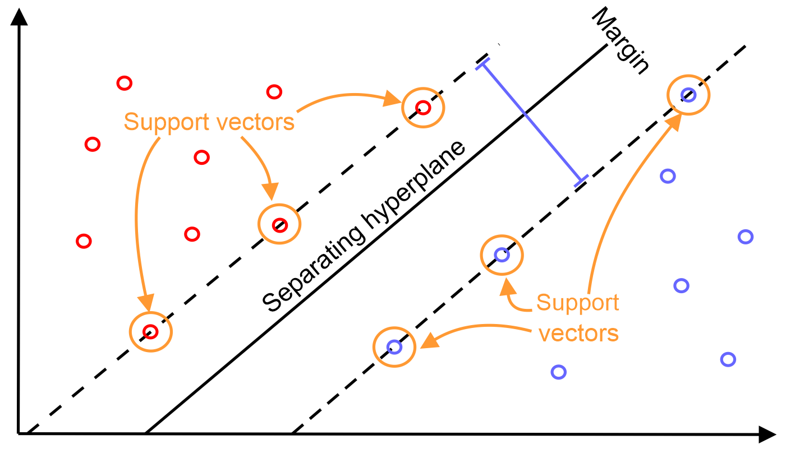

# MachineLearningWithPython
  
Machine Learning is a latest __buzzword__ floating around. It desrves to, as it is one of the most interesting subfield of Computer Science. 
__What does Machine Learning really means?__ 
Machine Learning is an application of artificial intelligence(AI) that provides systems the ability  to automatically learn and improve from experience without being explicitly programmed. 
__Machine Learning focuses on the development of computer programs__ that can access data and use it to learn for themsleves. 
The process of learning begins with data, such as, direct experience, or instruction, in order to look for patterns in data and make better decisions in the future based on the examples that we provide. __The primary aim is to allow the computers learn automatically__ without human intervention or assistance and adjust actions accordingly.
  

## Repository Overview
This repository is about different Machine Learning algorithm approaches as per the industry practices.

## Table of Contents
- [Profit Prediction](#section1) 
- [Classification - Logistic Reg](#section2) 
- [SVM Classification](#section3) 
- [Spam Detection](#section4) 

___

### [Profit Prediction](./Profit%20Prediction)

- You are the CEO of restaurant Franchise and are considering different cities for opening new outlet.
- The chain already has trucks in various cities and you have data for profits and population from the cities.
- You would like to use this data to help you select which city to expand to next.
- The dataset contains in the data folder of this Project.
- [Link for the Jupyter notebook](./Profit%20Prediction/Profit_Prediction.ipynb)
___

### [Probability of admission](./Classification-Logistic%20Reg)

- You are the administrator of a university department and you want to determine each applicant's chance of admission based on their
results on two exams.
- You have historical data from previous applicants that you can use as a training set for logistic regression.
- For each training example, you have the applicant's scores on two exams and the admissions decision.
- [Link for the Jupyter notebook](./Classification-Logistic%20Reg/Prob_of_admission.ipynb)
___
### [Accepting or Rejecting Microchips based on test results](./Classification-Logistic%20Reg)

- Suppose you are the product manager of the factory and you have the test results for some microchips on two different tests.
- From these two tests, you would like to determine whether the microchips should be accepted or rejected.
- To help you make the decision, you have a dataset of test results on past microchips, from which you can build a logistic regression model.
- [Link for the Jupyter notebook](./Classification-Logistic%20Reg/Microchip_test.ipynb)

___

### [SVM Classification](./SVM-Classification)

- We will see different examples of how SVM works.
- On 2D Dataset, with different values of C and Sigma usign Gaussian Kernels.
- On Trained dataset using learning best parameters from the function and cross validation.
- Visualizing linear and non-linear decision boundaries by SVM Classification.
- [Link for the Jupyter notebook](./SVM-Classification/SVM.ipynb)

___

### [Spam Detection](./Spam-Detection)

## Basic Approach
When we choose to approach spam filtering from a machine learning perspective, we view the problem as a classification problem. That is, we aim to classify an email as spam or not spam (ham) depending on its features. In our case, the features are the count of each word in the email. 

## Pre Processing
After preliminary pre-processing (removing HTML tags and headers from the email in the data set), we take the following steps:
1. __Tokenize__ - We create "tokens" from each word in the email by removing punctuation.
2. __Remove meaningless words__ -  The text in red squares are stop-words, which should be removed. Stop-words do not provide meaningful information to the classifier, and they increase dimensionality of feature matrix. In addition to many stop-words, we removed words over 12 characters and words less than three characters.
3. __Stem__ -  The text in blue circle is converted to its "stem". Similar words are converted to its stem in order to form a better feature matrix. This allows words with similar meanings to be treated the same. For example, history, histories, historic will be considered same word in the feature matrix. Each stem is placed into our "bag of words", which is just a list of every stem used in the dataset. 
4. __Create feature matrix__ - After creating the "bag of words" from all of the stems, we create a feature matrix. The feature matrix is created such that the entry in row i and column j is the number of times that token j occurs in email i. 
- [Link for the Jupyter notebook](./Spam-Detection/Spam-Detection.ipynb)

